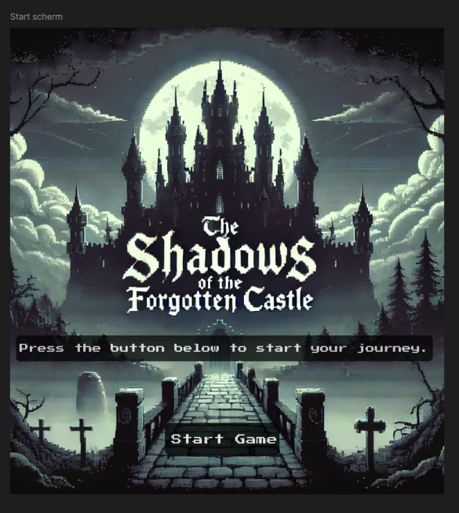
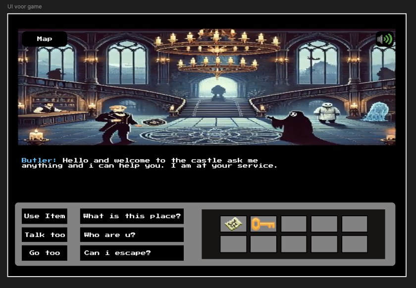

# UI

## Visuele Stijl
Het spel moet een mysterieuze en donkere toon zetten, passend bij het thema van een verlaten kasteel vol geheimen en gevaren. De visuele stijl moet gotische en middeleeuwse elementen bevatten, met veel schaduwen en gedempte kleuren om een gevoel van spanning en mysterie te creëren. Gebruik van licht en schaduw is belangrijk om de sfeer te versterken.

## Geluidseffecten
Geluidseffecten zijn een belangrijke toevoeging aan onze game. We streven ernaar om de geluiden zo realistisch en meeslepend mogelijk te maken, zodat ze de spelervaring versterken.

- **Omgevingsgeluiden:** Wind die door de gangen waait, krakende vloeren, druppelend water.
- **Interactieve geluiden:** Geluiden bij het openen van deuren, het oppakken van objecten, het oplossen van puzzels.
- **Spanningsopbouw:** Fluisterende geesten, plotselinge geluiden om schrikmomenten te creëren.

## UI Elementen
Specifieke UI elementen die ontwikkeld moeten worden:

- **Hoofdmenu:** Een eenvoudig, maar sfeervol menu met opties zoals Start, Instellingen, en Afsluiten.
- **Inventaris:** Een overzichtelijke inventaris waar spelers hun verzamelde objecten kunnen bekijken en gebruiken.
- **Dialoogvensters:** Stijlvolle vensters voor gesprekken met NPC's, met een gotische uitstraling.
- **Achievements:** Een scherm waar spelers hun behaalde prestaties kunnen bekijken. Dit scherm moet overzichtelijk zijn en dezelfde gotische stijl hebben als de rest van de UI. Het moet duidelijk laten zien welke prestaties al behaald zijn en welke nog openstaan.
- **Journal:** Een apart scherm waar spelers een journal kunnen bijhouden van hun voortgang en ontdekkingen. Dit scherm moet ook de gotische stijl volgen en spelers de mogelijkheid bieden om notities of stukjes papier verzamelen om zo belangrijke gebeurtenissen bij te houden.

## Wireframes

We hebben al wireframes gemaakt voor het startscherm en de gameplay UI. 

### Startscherm Wireframe
Het startscherm wireframe toont een eenvoudig maar sfeervol menu. Het bevat opties zoals Start, Instellingen, en Afsluiten. De gotische stijl is duidelijk zichtbaar in de keuze van lettertypen en de achtergrondafbeelding, die een mysterieus en donker kasteel toont.

### Gameplay UI Wireframe
De gameplay UI wireframe geeft een overzicht van hoe de interface eruit zal zien tijdens het spelen. Het bevat elementen zoals de inventory en dialoogvensters. De inventory is overzichtelijk en gemakkelijk toegankelijk, terwijl de dialoogvensters een gotische uitstraling hebben die past bij de rest van de visuele stijl.

### Geluidsinstellingen en Map

In de UI kunnen spelers ook hun geluidinstellingen aanpassen en de map openen. 

- **Geluidsinstellingen:** Een menu waar spelers het volume van de muziek, geluidseffecten en omgevingsgeluiden kunnen aanpassen. Dit menu moet eenvoudig te navigeren zijn en dezelfde gotische stijl hebben als de rest van de UI.
- **Map:** Een kaartscherm waar spelers de lay-out van het kasteel kunnen bekijken. Dit scherm moet gedetailleerd zijn en spelers helpen bij het navigeren door de verschillende kamers en gangen. De kaart moet ook de gotische stijl volgen en belangrijke locaties en objecten duidelijk markeren.
  

