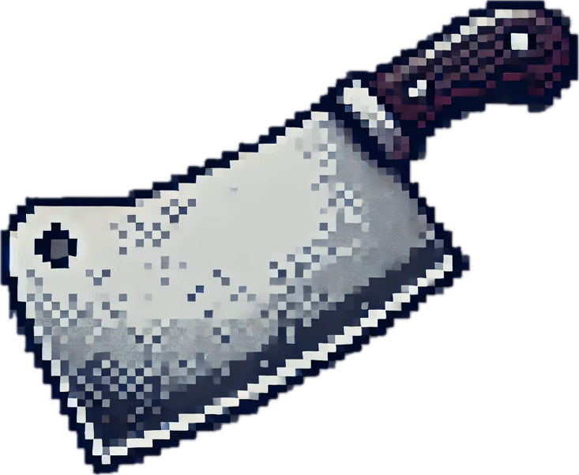

# Think-Make-Check voor Path to the Castle Room

## Cyclus 1:
### Think
Voor de BasementRoom wilde ik een mysterieuze omgeving creëren die als belangrijk knooppunt is in de game. De kamer moest verschillende elementen bevatten:

1. Sfeervolle omgeving: Een donkere, spookachtige kelder met passende visuele elementen
2. Hoofdkarakter: Een geest die centraal staat in de interactie
3. Quest mogelijkheden: Verbinding met andere quest-lijnen in het spel
4. Verborgen objecten: Items die de speler kan ontdekken door te interacteren met de omgeving
5. Intuïtieve navigatie: Duidelijke verbinding naar andere kamers

#### **elangrijke overwegingen bij het ontwerp waren:**

- De juiste balans tussen spanning en toegankelijkheid
- Voldoende diepgang in de dialoog met de geest
- Betekenisvolle verbindingen met andere questlijnen
- Gelaagde ontdekking van items en verhaallijnen

### Make
Op basis van deze overwegingen heb ik de BasementRoom ontwikkeld met de volgende elementen:

1. Visueel ontwerp: Een donkere kelder met spaarzame verlichting, spinnenwebben en stoffig meubilair
2. De Geest: Een ghostly character met een uitgebreide dialoogboom en een eigen questverhaal
3. Boekenkast: Een interactief object dat geheimen kan verbergen
4. Hidden Items: Een mysterieuze stok en een mes dat alleen onder specifieke voorwaarden verschijnt
5. Verbindingen met andere quests: Integratie met de Chef quest via het mes

#### **De implementatie omvatte:**
- Een gedetailleerde `BasementRoom` klasse met examine, walk en pick up functie
- Een `GhostCharacter` klasse met uitgebreide dialoog en queststatus-logica
- Conditional rendering van items op basis van speelvoortgang
- Atmosferische beschrijvingen bij het betreden van de kamer

### Check
Om de gebruikerservaring te evalueren, heb ik drie testers gevraagd de BasementRoom te verkennen:

### Testdoelen
- Evalueren of de sfeer van de kelder goed overkomt
- Testen of de interactie met de geest intuïtief en boeiend is
- Controleren of spelers de verbanden met andere questlijnen begrijpen
- Beoordelen of verborgen items ontdekt kunnen worden

### Testuitvoering
- Drie testers werden gevraagd de BasementRoom te verkennen
- Ze kregen 5 minuten voor vrije exploratie en specifieke taken
- Hun acties werden geobserveerd en na afloop werden vragen gesteld

### Feedback van de gebruikers:

### Tester 1: Natasha
**Sfeer:** "De beschrijvingen zijn heel beeldend. Ik kon de vochtige, muffe kelder bijna ruiken. 

**Geest interactie:** "De dialoog met de geest was interessant, maar ik was in het begin wat verward over wat ik moest doen. Het was niet direct duidelijk dat hij een questverhaal had."

**Verbeterpunt:** "Ik zou graag wat visuele hints willen zien bij objecten waarmee ik kan interacteren. Nu moest ik veel uitproberen om te ontdekken wat mogelijk was."

### Tester 2: Erik
**Verborgen items:** "Het vinden van de mysterieuze stok voelde als een echte ontdekking. Ik had niet verwacht dat de boekenkast iets zou verbergen. Maar het was moeilijk te begrijpen dat ik eerst met de geest moest praten voordat sommige items verschenen."

**Quest integratie:** "De verbinding met de Chef quest via het mes was slim gevonden. Het voelt als een myserieuze wereld waar alle elementen met elkaar verbonden zijn."

**Verbeterpunt:** "De geest zou actiever kunnen reageren op de speler bij binnenkomst. Nu moest ik zelf het initiatief nemen om met hem te praten, terwijl dit een belangrijk karakter in de kamer is."

### Tester 3: Bryan
**Navigatie:** "Het was duidelijk hoe ik tussen kamers kon navigeren. De verbinding met de lobby werkte prima."

**Dialoogkeuzes:** "Ik vond het leuk dat er verschillende manieren waren om met de geest te praten. De verschillende dialoogopties geven het gevoel dat je keuzes ertoe doen."

**Verbeterpunt:** "De beschrijving van de kamer is goed, maar zou nog uitgebreid kunnen worden met meer details over specifieke objecten. Nu moet je zelf ontdekken wat er allemaal is."

### Resultaten
Op basis van de feedback van de testers heb ik de volgende resultaten vastgesteld:

- De sfeer van de kelder komt goed over via de beschrijvingen en visuele elementen
- De interactie met de geest is interessant maar kan intuïtiever gemaakt worden
- De verbanden met andere questlijnen worden begrepen en gewaardeerd
- Verborgen items worden gevonden maar het proces kan verduidelijkt worden

### Conclusie
De eerste testcyclus van de BasementRoom heeft waardevolle inzichten opgeleverd. Spelers waarderen de atmosfeer en het verhaal, maar er zijn verbeterpunten geïdentificeerd in de interactiviteit en duidelijkheid. De belangrijkste aandachtspunten zijn:

1. Betere visuele hints voor interactieve objecten
2. Proactievere initiatie van interactie door de geest
3. Meer gedetailleerde beschrijvingen van objecten in de kamer
4. Duidelijkere indicaties van quest-voortgang en beschikbare items

Deze feedback zal worden gebruikt om de BasementRoom te optimaliseren in de volgende TMC-cyclus.

## Cyclus 2: Verbeteringen en nieuwe functionaliteiten
### Reflectie op Cyclus 1
Na analyse van de feedback uit de eerste testcyclus heb ik de volgende verbeterpunten geïdentificeerd:

1. De interactie met de geest was niet direct duidelijk voor nieuwe spelers
2. Verborgen items waren te moeilijk te ontdekken zonder duidelijke aanwijzingen
3. De kamerobjecten hadden meer beschrijvende details nodig
4. De verbindingen tussen quests konden explicieter gemaakt worden
5. De visuele feedback bij interacties was minimaal

#### **Doorgevoerde verbeteringen:**
Op basis van deze reflectie heb ik de volgende verbeteringen aangebracht:

1. Proactieve Geest:
   - Toegevoegde subtiele animatie waardoor de geest meer opvalt in de kamer
   - Uitgebreide dialoogopties die duidelijker wijzen op beschikbare quests
2. Verbeterde item discovery:
   - Als je nu de boekenkast examined dan krijg je een tekst te zien dat je daar achter gelijk iets gevonden heb. Je moet het nu op pakken om het in je inventory te zetten.
3. Duidelijkere quest-integratie:
   -  De geest geeft nu specifiekere hints over de Chef quest
   -  Dialog-opties die veranderen op basis van de speler's voortgang in andere quests

### Testdoelen
Voor de tweede cyclus stelde ik de volgende doelen:

- Evalueren of de proactieve geest de interactie verbetert
- Controleren of verborgen items nu makkelijker te ontdekken zijn
- Beoordelen of de verbeterde omgevingsbeschrijvingen de atmosfeer verbeterd
- Testen of de quest-integratie nu duidelijker is

### Testuitvoering
- Dezelfde drie testers werden gevraagd om het verbeterde ontwerp te evalueren
- De testsessies duurden opnieuw ongeveer 5 minuten per tester
- Dezelfde vragen en observaties werden gebruikt om directe vergelijking mogelijk te maken

### Feedback van de gebruikers:

### Tester 1: Natasha
**Geest interactie:** "Wat een verschil! De geest die me direct aanspreekt maakt het veel natuurlijker om een gesprek te beginnen. Ook de animatie maakt het duidelijker dat dit een belangrijk karakter is."

**Omgevingsbeschrijvingen:** "De extra details in de beschrijvingen maken de ruimte veel levendiger. Nu voelt het echt alsof ik in een oude kelder ben. De specifieke beschrijvingen van verschillende hoeken geven me meer zin om rond te kijken."

**Algemeen:** "Het voelt veel intuïtiever nu"

### Tester 2: Erik
**Quest integratie:** "De verbindingen tussen quests zijn nu veel duidelijker. Ik begreep direct dat ik het mes voor de Chef kon krijgen door met de geest te praten over zijn quest."

**Verbeterpunt:** "Misschien nog iets meer variatie in de reacties van de geest als je meerdere keren met hem praat? Nu herhaalt hij soms dezelfde zinnen."

### Tester 3: Bryan
**Dialoogkeuzes:** "De nieuwe dialoogopties die veranderen op basis van mijn voortgang zijn perfect. Het voelt alsof de geest echt reageert op wat ik doe in het spel."

**Suggestie:** "Het zou nog cooler zijn als de sfeer in de kamer verandert nadat je de quest van de geest hebt voltooid. Misschien iets met de verlichting of achtergrondgeluiden?"

### Resultaten
Op basis van de feedback uit de tweede testcyclus kunnen de volgende resultaten worden vastgesteld:

- De proactieve geest maakt de interactie veel natuurlijker en intuïtiever
- De verbeterde quest-integratie zorgt voor een coherentere spelervaring
- De visuele feedback maakt de interacties duidelijker en bevredigender

### Conclusie
De tweede testcyclus toont een significante verbetering in de BasementRoom ervaring. De doorgevoerde verbeteringen op basis van de feedback uit cyclus 1 hebben geresulteerd in een meeslependere en visueel aantrekkelijkere spelomgeving. De testers waren positief over de verbeteringen, met name over de proactieve geest.

De BasementRoom werkt nu effectiever als een belangrijk knooppunt in het spel, met duidelijke verbindingen naar andere questlijnen en een verhaallijn die spelers motiveert om te exploreren en te interacteren. De suggesties voor verdere verbeteringen (zoals variatie in dialoog en dynamische omgevingsveranderingen) bieden interessante mogelijkheden voor toekomstige iteraties, maar worden niet als kritisch beschouwd voor het huidige ontwerp.

Deze TMC-cycli demonstreren de waarde van iteratief ontwerpen en gebruikersfeedback in het creëren van een boeiende en gebruiksvriendelijke game-ervaring. Door gerichte verbeteringen door te voeren op basis van specifieke feedback punten, is de BasementRoom getransformeerd van een interessante maar soms onduidelijke omgeving naar een rijk, intuïtief en meeslepend onderdeel van het spel.
