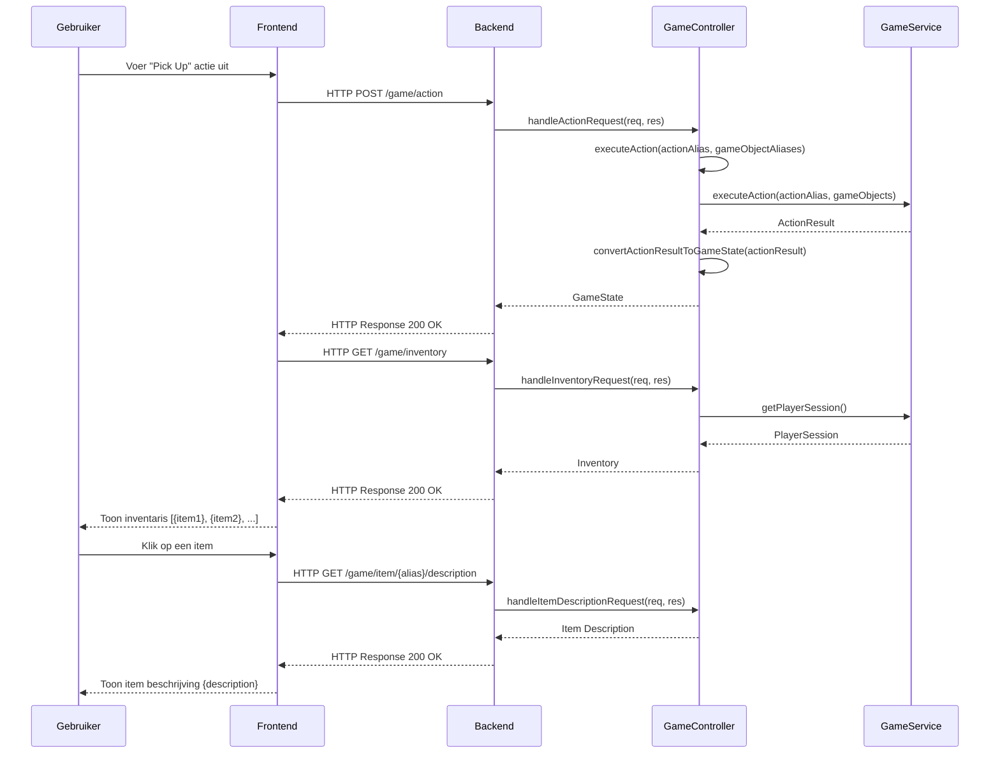
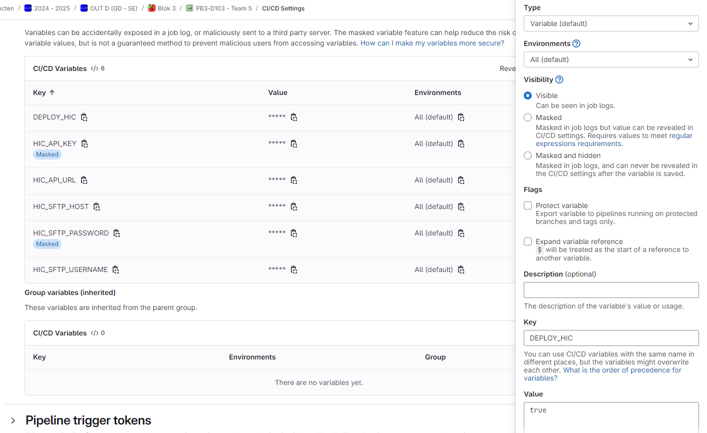
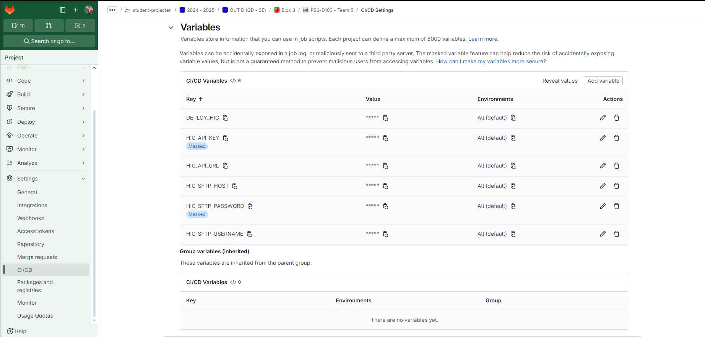
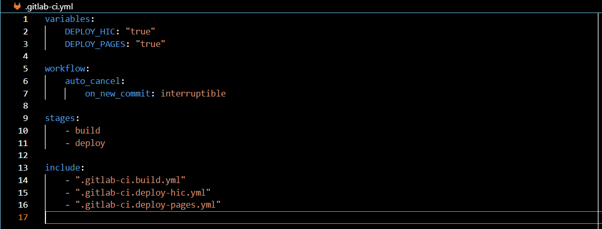
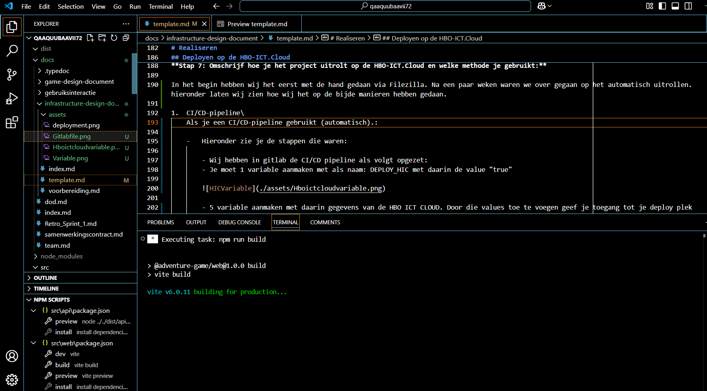
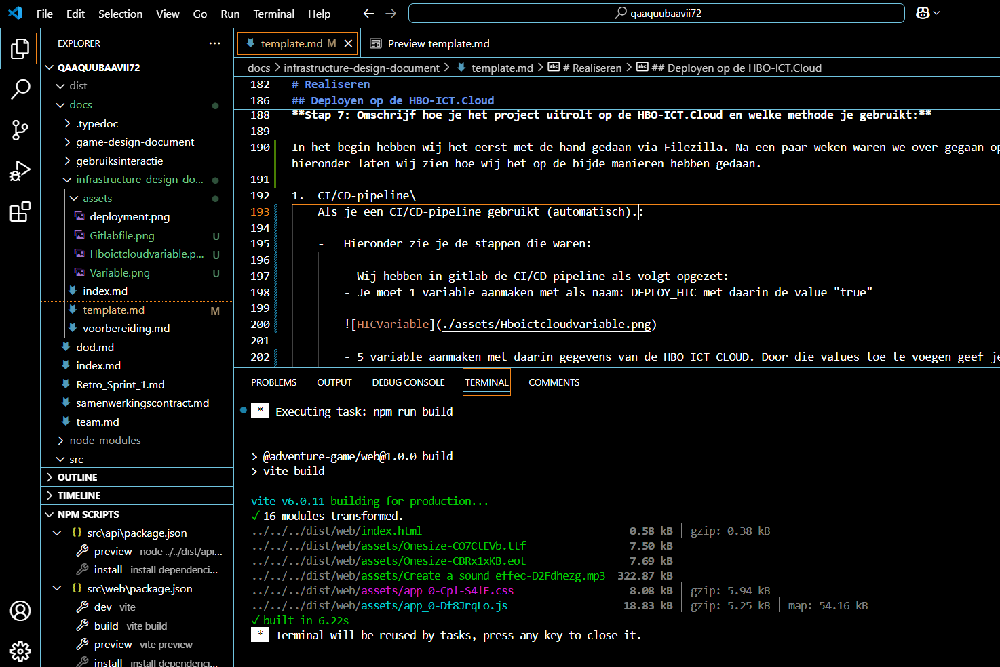
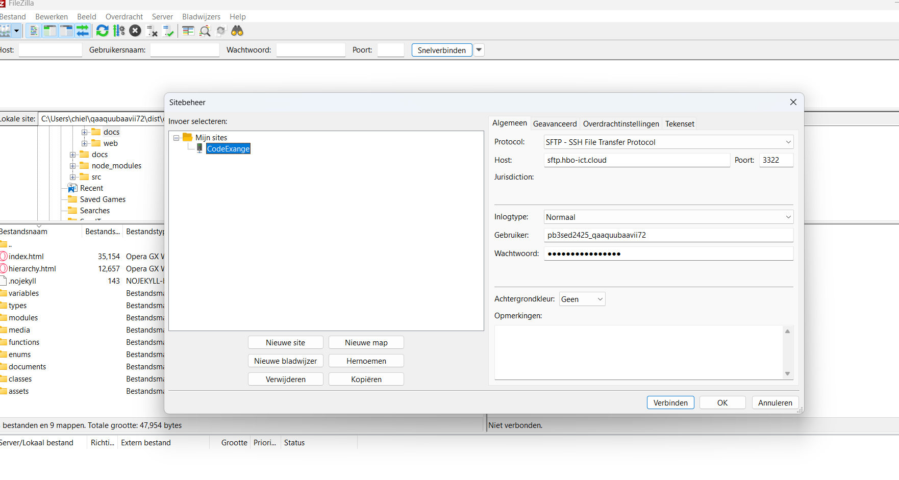
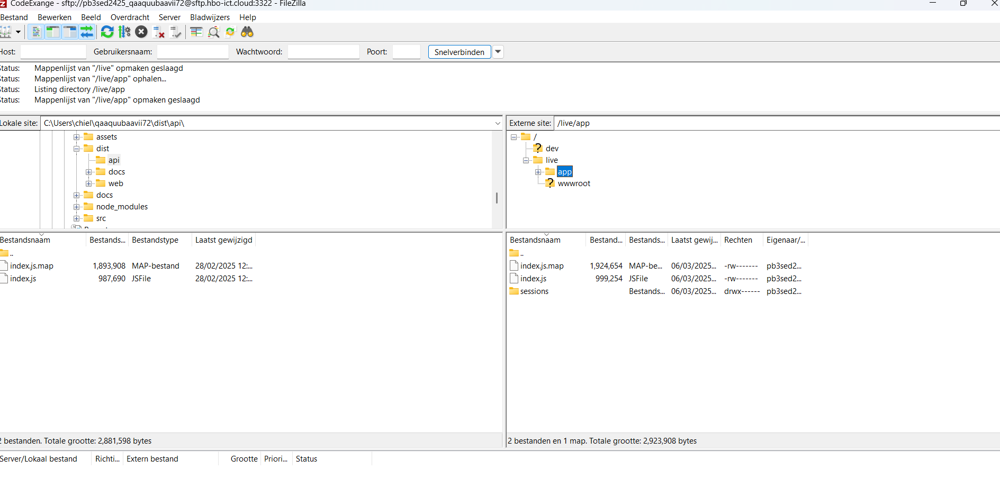
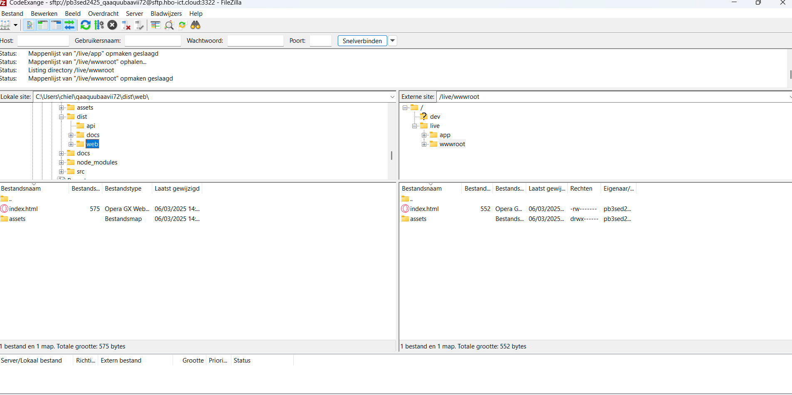
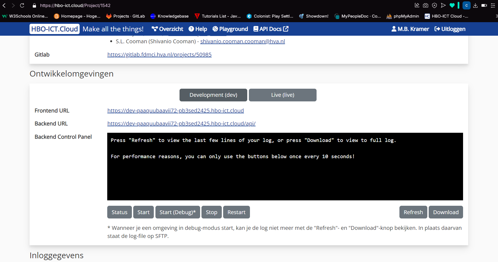

# Infrastructure design document

## Inleiding


Lucastars is een game-ontwikkelstudio die zich richt op innovatieve en interactieve game-ervaringen. De organisatie bestaat uit verschillende stakeholders, waaronder de Product Owner (P.O.), de Chief Technology Officer (CTO), en het ontwikkelteam. Deze stakeholders spelen een cruciale rol bij het definiëren van de functionele en technische vereisten van de game. Daarnaast zijn docenten en begeleiders betrokken bij het proces om de kwaliteit van het eindproduct te bewaken en studenten te ondersteunen in hun ontwikkeling.

Het doel van dit verslag is om de technische netwerkeisen voor de game te bepalen. Dit is onderzocht door bestaande technische productdocumentatie, documentatie van Express.js en gesprekken met de Product Owner te analyseren. De hoofdvraag die hierbij centraal staat, luidt: "Wat zijn de technische netwerkeisen die nodig zijn om de game optimaal te laten functioneren?"

Om deze hoofdvraag te beantwoorden, worden verschillende onderwerpen behandeld, zoals de benodigde serverarchitectuur, netwerkbeveiliging, dataverwerking en opslag, en interacties tussen gebruikers en de infrastructuur. Hierdoor ontstaat een helder beeld van de vereisten voor de IT-infrastructuur van de game.

# Context en Vereisten

## Organisatorische Context

**Opdracht en Opdrachtgever**

De game wordt ontwikkeld als een Proof of Concept voor Game Studio Lucastars. Het project wordt begeleid door de Product Owner en de CTO, die gezamenlijk de technische en inhoudelijke eisen formuleren. Het ontwikkelteam is verantwoordelijk voor de implementatie en het onderhoud van de game.

**Gebruikers en hun Rollen**

**Spelers:** Interacteren met de game, slaan voortgang op en hervatten het spel.

**Ontwikkelteam:** Werkt aan de ontwikkeling van de gamefunctionaliteit, de backend en de database.

**Docenten & Begeleiders:** Begeleiden het ontwikkelproces en beoordelen de kwaliteit van het eindproduct.

# Contextbeschrijving

**Wie zijn de gebruikers van de infrastructuur? :**

Spelers, ontwikkelaars, en docenten.

**Welke acties voeren zij uit? Hoe vaak? :**

Spelers spelen de game dagelijks en slaan voortgang op.

Ontwikkelaars updaten en onderhouden de infrastructuur wekelijks.

Docenten beoordelen de game per iteratie.

**Welke bedrijfsdoelen ondersteunt de infrastructuur? :**

Het leveren van een stabiele en veilige spelervaring.

Het faciliteren van efficiënte ontwikkeling en onderhoud.

**Welke interacties vinden plaats tussen gebruikers en de infrastructuur? :**

Spelers communiceren met de backend voor data-opslag en game-logica.

Ontwikkelaars werken aan en testen de infrastructuur.

**Hoe worden gegevens verwerkt, opgeslagen en beveiligd binnen de infrastructuur? :**

Data wordt opgeslagen in een centrale database en beveiligd via encryptie en toegangsbeheer.

**Welke eisen of verwachtingen stellen stakeholders aan de infrastructuur? :**

Hoge beschikbaarheid, lage latentie, en sterke beveiligingsmaatregelen.

## Technische Context

**Stap 2: Beschrijf de belangrijkste infrastructuur-concepten**

Bij het bouwen van onze game moeten alle onderdelen goed samenwerken, anders wordt het een chaos. Daarom gebruiken we een paar slimme infrastructuurmethoden die ervoor zorgen dat alles soepel verloopt en makkelijk uit te breiden is. Drie belangrijke onderdelen daarvan zijn API’s voor communicatie, frontend-componenten en data-uitwisseling. Hieronder leg ik uit hoe die werken en waarom ze perfect passen bij onze game.

-  ### API's voor communicatie:

    Stel je voor: de speler loopt door een donkere gang en komt bij een grote houten deur. Maar voordat hij erdoor mag, moet hij een wachtwoord invoeren. Hoe weet het spel of het antwoord correct is? Hier komt een API om de hoek kijken.

    Een API is als een boodschapper tussen de frontend (de visuele kant van de game) en de backend (de plek waar alle gegevens worden opgeslagen en verwerkt). In onze game kunnen we dit gebruiken voor verschillende dingen. Bijvoorbeeld, als een speler een quiz beantwoordt in de GuardQuizRoom, kan de API controleren of het antwoord goed is en bepalen of de speler door mag naar de volgende kamer. Ook kan een API helpen om spelerprogressie op te slaan, zodat we kunnen onthouden welke deuren al zijn geopend of welke items de speler bij zich draagt.

    Dankzij API’s voelt de game dynamischer aan en kunnen acties van de speler echte gevolgen hebben. Een fout antwoord? Misschien blijft de poort dan gesloten. Een goed antwoord? Dan schuiven de zware deuren langzaam open, terwijl een diepe stem zegt: "Je hebt de juiste keuze gemaakt..."


-   ### Frontend-componenten:
    In onze game bestaan kamers uit verschillende objecten waarmee de speler kan interacteren: een tafel met mysterieuze papieren, een oude kast die misschien iets verbergt, een sleutel die glinstert in het maanlicht. Maar stel je voor dat we al deze elementen telkens opnieuw moesten programmeren voor elke kamer… Dat zou enorm veel tijd kosten.

    Gelukkig gebruiken we frontend-componenten, die werken als bouwstenen voor de interface. Dit betekent dat als we eenmaal een interactief object, zoals een deur of een NPC, hebben gemaakt, we dat in meerdere kamers kunnen gebruiken. De GameOverRoom bijvoorbeeld, heeft een standaard lay-out met een eindscherm en een knop om opnieuw te beginnen. Dankzij frontend-componenten hoeven we dat niet steeds opnieuw te programmeren – we kunnen het gewoon hergebruiken.

    Door de kamers en hun objecten modulair op te bouwen, wordt het makkelijker om de game uit te breiden. Stel je voor dat we later een nieuwe kamer toevoegen, zoals een geheime bibliotheek vol raadselachtige boeken. In plaats van alles opnieuw te maken, kunnen we gewoon bestaande componenten combineren en aanpassen. Dit bespaart tijd en maakt het spel consistenter.

-   ### Data-uitwisseling: 
    De speler heeft eindelijk een belangrijk item gevonden: een gouden sleutel. Maar hoe weet het spel dat hij deze bij zich heeft als hij bij de CastleDoorEntranceRoom aankomt? Dit is waar data-uitwisseling met de Fetch API van pas komt.

    De Fetch API zorgt ervoor dat gegevens in real-time worden opgehaald of opgeslagen. Wanneer de speler een sleutel oppakt, kan dit meteen worden vastgelegd, zodat het spel later kan controleren of hij deze nog steeds heeft. Dit voorkomt frustratie en zorgt ervoor dat acties betekenis hebben. Ook bij interactieve elementen zoals quizzen of dialogen kan de Fetch API helpen om antwoorden direct te verwerken en feedback te geven zonder dat de hele game hoeft te herladen.

    Dankzij deze technologie voelt de game vloeiender en responsiever aan. Stel je voor dat de speler een raadsel moet oplossen bij een mysterieuze poort. In plaats van dat de game vastloopt terwijl er op een antwoord wordt gewacht, reageert de wereld meteen: de lichten flikkeren, een diepe stem lacht, en de poort opent langzaam… Of niet, als het antwoord fout was.

> De volgende Deployment Diagram geeft inzicht in de verschillende onderdelen van "The Game":


Deze concepten ondersteunen functionele vereisten zoals het opslaan van voortgang, veilige communicatie, en ondersteuning voor meerdere gebruikers. Raadpleeg de HBO-ICT Knowledgebase voor uitgebreide uitleg en praktische voorbeelden.

## Vereisten, standaarden, en richtlijnen

**Stap 3: Beschrijf vereisten, standaarden, en richtlijnen**

Bij het ontwerpen van de infrastructuur moet je de vereisten, standaarden, en richtlijnen van de opdrachtgever helder beschrijven. Je moet ze niet alleen noemen, maar ook uitleggen wat hier voor nodig is. Overleg met de product owner over wat hij hier van jullie verwacht. Hier zijn enkele voorbeelden:

### Functionele vereisten

-   Minstens 100 gelijktijdige spelers kunnen de game spelen.

-   Gebruikers kunnen als de P.O. dit wil voortgang opslaan en hervatten op verschillende apparaten.

-   De game is toegankelijk via een webbrowser met een centrale database, of wellicht ook via een app.

### Technische vereisten

-   De API ondersteunt veilige communicatie via HTTPS.

-   Data wordt centraal opgeslagen in een database.

-   Er is een schaalbare infrastructuur om groeiende spelersaantallen aan te kunnen.

### Standaarden en richtlijnen

-   Volg industriepraktijken zoals OWASP-beveiligingsrichtlijnen voor veilige API's.

-   Gebruik coding standards voor TypeScript en Node.js, zoals de ESLint-configuratie in de HBO-ICT Knowledgebase.

### Wetten en regelgeving

-   Voldoe aan privacywetten zoals de AVG (GDPR) bij het opslaan van gebruikersdata.

Tip: Controleer of alle vereisten testbaar zijn. Testbaarheid helpt je later in het project om succes te meten en eventuele aanpassingen te maken. Raadpleeg de HBO-ICT Knowledgebase voor meer details over standaarden en richtlijnen.

# Infrastructuur

Dit hoofdstuk richt zich op het beschrijven van de infrastructuur zoals deze draait op de HBO-ICT.Cloud. Tijdens de ontwikkeling werkt het team lokaal (op je eigen pc) aan de game, maar voor testen en productie wordt gebruikgemaakt van een ontwikkel- en liveomgeving op de HBO-ICT.Cloud. Aangezien de infrastructuur vooraf is vastgelegd, ligt de nadruk op het documenteren van bestaande configuraties, het verduidelijken van de communicatie tussen onderdelen en het onderzoeken van verbeterpunten.

## Inrichting van de infrastructuur

**Stap 4: Beschrijf de inrichting van de infrastructuur**

De infrastructuur voor dit project wordt volledig gehost op de HBO-ICT.Cloud, bestaande uit meerdere componenten die naadloos samenwerken om een complete game-ervaring te leveren.

### Infrastructuur componenten

#### 1. Frontend
- **Technologie**: Een statisch gehoste webapplicatie gebouwd met HTML, CSS en TypeScript.
- **Implementatie**: Maakt gebruik van Web Components voor een onderhoudbare codebase.
- **Gebruikersinteractie**: Biedt een intuïtieve spelinterface die spelers in staat stelt om met de gamewereld te interageren.
- **Rendering**: Verwerkt visuele elementen en animaties voor een meeslepende spelervaring.
- **State Management**: Houdt de huidige spelstatus bij en synchroniseert deze met de backend.

#### 2. Backend
- **Framework**: Een API-server gebouwd met Express.js, draaiend in een Node.js omgeving.
- **Architectuur**: RESTful API met duidelijk gedefinieerde endpoints voor verschillende spelacties.
- **Verantwoordelijkheden**:
  - Verwerken van spelacties
  - Bijhouden van spelerssessies en -voortgang
  - Uitvoeren van game-logica en regels
  - Beheren van de inventaris van de speler

#### 3. CI/CD-pipeline
- **Automatisering**: Geautomatiseerde processen voor het bouwen, testen en deployen van de applicatie.
- **Tooling**: Maakt gebruik van GitLab CI/CD voor continue integratie en implementatie.
- **Workflow**:
  - Code wordt gecommit naar de repository
  - Automatische tests worden uitgevoerd
  - Bij succesvolle tests wordt de applicatie automatisch gedeployed naar de HBO-ICT.Cloud

### Netwerkarchitectuur

De communicatie tussen de componenten verloopt via een gestandaardiseerd protocol:

- **Client-server communicatie**: HTTP/HTTPS requests tussen frontend en backend
- **API Gateway**: Centraal punt voor alle API-requests, zorgt voor routing naar de juiste endpoints
- **Sessiemanagement**: Implementeert sessie-tracking voor gebruikersauthenticatie en spelvoortgang

### Toegangspunten

Onze game is toegankelijk via de volgende URLs:

- **Frontend URL**: [https://qaaquubaavii72-pb3sed2425.hbo-ict.cloud](https://qaaquubaavii72-pb3sed2425.hbo-ict.cloud)
- **Backend URL**: [https://qaaquubaavii72-pb3sed2425.hbo-ict.cloud/api/](https://qaaquubaavii72-pb3sed2425.hbo-ict.cloud/api/)

### Netwerkconfiguratie

- **Poorten**: De frontend draait lokaal op poort 3000 tijdens ontwikkeling, terwijl de backend API gebruikmaakt van poort 3001 voor communicatie. In de productieomgeving worden standaard HTTP/HTTPS poorten gebruikt.
- **Protocollen**: Alle communicatie verloopt via beveiligde HTTPS-verbindingen in de productieomgeving.

### Responsiveness

De infrastructuur is ontworpen met responsiveness in gedachten:

- **Adaptieve interface**: De frontend past zich aan verschillende schermgroottes en apparaten aan
- **Efficiënte verwerking**: Asynchrone communicatie zorgt voor een soepele gebruikerservaring
- **Caching-strategieën**: Geïmplementeerd voor veelgebruikte resources om de reactietijd te verbeteren

Deze focus op responsiveness zorgt voor een vloeiende en interactieve spelervaring, ongeacht het apparaat of de netwerksnelheid van de gebruiker.

## Communicatie en sequence diagram

**Stap 5: Beschrijf de communicatie tussen de systemen**

Hieronder staat ons sequence diagram. Dit diagram illustreert een fetch-verzoek van de frontend naar de backend en terug.



### Uitleg van de communicatiestromen

Het bovenstaande sequence diagram toont drie belangrijke communicatiestromen in onze game-applicatie:

#### 1. "Pick Up" actie uitvoeren
Wanneer de gebruiker een item wil oppakken, wordt de volgende communicatiestroom geïnitieerd:

- **Frontend naar Backend**: De frontend verstuurt een HTTP POST request naar het `/game/action` endpoint, met daarin de actie "pick up" en de alias van het op te pakken object.
- **Backend verwerking**: De `GameController` verwerkt dit request via de `handleActionRequest` methode en voert de actie uit met behulp van de `GameService`.
- **Response**: Het resultaat wordt omgezet naar een `GameState` en teruggestuurd naar de frontend, waardoor de spelstatus wordt bijgewerkt.

#### 2. Inventaris ophalen
Na het oppakken van een item wordt de inventaris automatisch bijgewerkt:

- **Frontend naar Backend**: De frontend stuurt een HTTP GET request naar het `/game/inventory` endpoint om de bijgewerkte inventaris op te halen.
- **Backend verwerking**: De `GameController` haalt via de `handleInventoryRequest` methode de speler-sessie op en extraheert de inventarisgegevens.
- **Response**: De backend stuurt een lijst van items terug naar de frontend, die deze vervolgens weergeeft aan de gebruiker.

#### 3. Item beschrijving bekijken
Wanneer de gebruiker op een item in de inventaris klikt:

- **Frontend naar Backend**: De frontend stuurt een HTTP GET request naar het `/game/item/{alias}/description` endpoint met de alias van het geselecteerde item.
- **Backend verwerking**: De `GameController` verwerkt dit via de `handleItemDescriptionRequest` methode.
- **Response**: De beschrijving van het item wordt teruggestuurd en aan de gebruiker getoond.

### Technische implementatie

De communicatie tussen de frontend en backend maakt gebruik van de volgende componenten:

1. **Frontend services**:
   - `InventoryService` voor het ophalen van de inventaris en itembeschrijvingen
   - `GameRouteService` voor het uitvoeren van game-acties zoals "pick up"

2. **Backend controllers en routes**:
   - Route `/game/action` voor het uitvoeren van spelacties
   - Route `/game/inventory` voor het ophalen van de inventaris
   - Route `/game/item/{alias}/description` voor het ophalen van itembeschrijvingen

3. **Communicatieprotocol**:
   - Alle communicatie verloopt via HTTP GET en POST requests
   - Data wordt uitgewisseld in JSON-formaat
   - Elke request bevat een header met de speler-sessie ID voor authenticatie

Deze architectuur zorgt voor een duidelijke scheiding van verantwoordelijkheden en maakt een efficiënte communicatie tussen frontend en backend mogelijk, wat essentieel is voor een responsieve en interactieve spelervaring.

## Beveiliging van de infrastructuur

**Stap 6: Omschrijf hoe de systemen veilig ingericht kunnen worden**

### Waarom beveiliging essentieel is
Online applicaties, maar zelfs echte apps, zijn voortdurend blootgesteld aan verschillende soorten bedreigingen. Zonder adequate beveiliging kunnen kwaadwillende personen toegang krijgen tot gegevens en uiteindelijk de functionaliteit van de applicatie manipuleren, of zelfs de hele infrastructuur verstoren. Dit kan leiden tot een slechte gebruikerservaring en in ernstige gevallen zelfs juridische gevolgen.

### Beveiligingsmaatregelen
De Express.js-server biedt verschillende mogelijkheden om de infrastructuur veiliger te maken. Sommige maatregelen beperken misbruik, terwijl andere bepaalde aanvallen volledig kunnen voorkomen:

- **HTTPS**: Je hoeft HTTPS niet zelf te configureren, omdat dit al standaard is geregeld binnen de HBO-ICT.Cloud. Alle communicatie via de cloudomgeving verloopt automatisch versleuteld. HTTPS voorkomt het onderscheppen van gegevens tussen client en server (man-in-the-middle aanvallen).


- **Rate limiting**: Beperkt het aantal requests per gebruiker om misbruik te voorkomen. Dit kan worden geïmplementeerd met middleware zoals `express-rate-limit`. Rate limiting beperkt brute force aanvallen en DoS-pogingen, maar voorkomt ze niet volledig als aanvallers over meerdere IP-adressen beschikken.

``` TS
const rateLimit = require('express-rate-limit');

// Create a rate limiter to limit requests to a specific route
const limiter = rateLimit({
  windowMs: 15 * 60 * 1000, // Time window: 15 minutes
  max: 100, // Maximum 100 requests per window per IP
  standardHeaders: true, // Include rate limit info in response headers
  message: 'Too many requests, please try again later' // Message sent when limit is exceeded
});

app.use('/game/action', limiter); // Apply on specific routes
```

- **CORS**: Stel specifieke regels in voor welke domeinen toegang hebben tot de API. Dit kan worden ingesteld met de `cors` middleware in Express.js. Correcte CORS-configuratie voorkomt ongeautoriseerde cross-domain requests.
``` TS
const cors = require('cors'); // Import the CORS middleware

// Configure CORS to allow requests only from our specific frontend
const corsOptions = {
  origin: 'https://qaaquubaavii72-pb3sed2425.hbo-ict.cloud', // Allow requests only from this domain
  optionsSuccessStatus: 200 // Ensure successful responses for legacy browsers
};

// Apply the CORS middleware with the defined options
app.use(cors(corsOptions));
```
- **Content Security Policy (CSP):** Deze header voorkomt XSS-aanvallen door te specificeren welke bronnen van content mogen worden uitgevoerd in de browser. Met de juiste configuratie kunnen kwaadaardige scripts worden geblokkeerd voordat ze worden uitgevoerd.
  

- **Environment variables**: Het gebruik van `.env`-bestanden voor gevoelige gegevens voorkomt het lekken van wachtwoorden en API-keys via versiebeheersystemen. Dit is cruciaal voor de bescherming van toegangsgegevens.


- **Security Headers**: Voeg beveiligingsheaders toe aan HTTP-responses om aanvallen zoals XSS en clickjacking te voorkomen. Dit kan worden gedaan met de `helmet` middleware. Deze Express middleware voorkomt verschillende soorten aanvallen door beveiligingsheaders in te stellen:
``` TS
const helmet = require('helmet'); // Import the Helmet middleware

// Use Helmet to enhance security by setting various HTTP headers
app.use(helmet());
```

- **Database Security**: Zorg ervoor dat de database alleen toegankelijk is voor geautoriseerde applicaties en gebruikers. Gebruik sterke wachtwoorden en versleuteling voor gevoelige gegevens.

### Balans tussen beveiliging en gebruiksvriendelijkheid
Het is belangrijk om te beseffen dat sommige beveiligingsmaatregelen de gebruikservaring kunnen beïnvloeden. Te strikte rate limiting kan legitieme gebruikers blokkeren, en te strikte CSP-regels kunnen functionaliteiten van de website beperken. Daarom moet je een balans vinden die de gebruiksvriendelijkheid niet in gevaar brengt.

### Gelaagde beveiliging
Geen enkele beveiligingsmaatregel is perfect, daarom implementeren we een gelaagde benadering. Als één beveileing methode faalt, kunnen andere lagen nog steeds bescherming bieden. Deze "defense in depth"-strategie is de meest effectieve aanpak voor het beveiligen van complexe systemen.

## Realiseren

In dit hoofdstuk beschrijf je hoe het project live wordt gezet op de HBO-ICT.Cloud, welke beveiligingsmaatregelen je implementeert, en hoe je omgaat met de inrichting van de database.

## Deployen op de HBO-ICT.Cloud

**Stap 7: Omschrijf hoe je het project uitrolt op de HBO-ICT.Cloud en welke methode je gebruikt:**

In het begin hebben wij het eerst handmatig uitgerold naar de cloud via Filezilla. Na een paar weken zijn we overgegaan op het automatisch uitrollen. Hieronder laten wij zien hoe wij dit op beide manieren hebben gedaan.

1.  CI/CD-pipeline\
    Als je een CI/CD-pipeline gebruikt (automatisch):

    -   Hieronder zie je de stappen die we hebben gevolgd:

        - Op de [Knowledgebase](https://knowledgebase.hbo-ict-hva.nl/3_onderwijs/se/opdracht3/2_project/hboictcloud/#automatisch-uitrollen-naar-de-hbo-ictcloud) staat een gedetailleerd document dat uitlegt hoe het werkt. Volg dit document stap voor stap.

        - Je moet één variabele aanmaken met de naam: DEPLOY_HIC met de waarde "true" om het proces voor het uitrollen naar de HIC in te schakelen.

        

        - Maak vijf variabelen aan met gegevens van de HBO ICT CLOUD. Door deze waarden toe te voegen, geef je toegang tot je deploy locatie (HBO ICT CLOUD).

        

        - Deployen naar de HBO-ICT.Cloud:
        - Nadat je alle gegevens hebt toegevoegd, moet je in het bestand .gitlab-ci.yml bovenaan de DEPLOY_HIC op true zetten.

        

        - Alles wat je dan op de Main zet, wordt vanaf dat punt automatisch uitgerold naar de cloud.

2.  Handmatige deployment (FTP)\
    Als je handmatig deployt:

    -   Frontend: Bouw de frontend (met npm run build) en upload de bestanden naar de cloud. Dat deden wij via het programma FileZilla.

        Eerst bouwde wij de game met de NPM run build en dat moetst dan met de API en de WEB.

        

        

    -   Nadat de build klaar was hebben we FileZilla geopent en eerst conectie met de cloud gelegt. Dat moest met je SFTP host en daaronder je gebruikers naam met het wachtwoord

        

    - Toen we er in kwamen zagen we 2 files app en wwwroot. in de app moet alles van de api en in wwwroot moest alles wat van de web kwam.

        
        

    -   Wij gebruiken dit project geen Database dus de connectie hoefte niet.
    -   Nadat alle files goed waren over gezet ging ik naar de HIC toe om te testen op de live of het werkte
        
        

    -   Als je deze link klikt kom je bij het project op de live server: [Live server](https://qaaquubaavii72-pb3sed2425.hbo-ict.cloud)


## Beveiligingsmaatregelen

**Stap 8: Omschrijf welke maatregelen je implementeert**

Hoewel HTTPS standaard is geactiveerd op de HBO-ICT.Cloud, zijn aanvullende beveiligingen nodig voor de backend en database, zoals:

-   CORS: Beperk toegang tot de API vanuit specifieke domeinen om ongeautoriseerde toegang te voorkomen.

-   Rate limiting: Voeg beperkingen toe aan het aantal verzoeken per tijdseenheid om misbruik te voorkomen.

-   Environment variables: Gebruik een .env-bestand om gevoelige gegevens zoals databasewachtwoorden en API-sleutels te beheren.

## Database-inrichting

**Stap 9: Omschrijf welke gegevens je opslaat in de database en waarom, met aandacht voor "privacy by design":**

-   Data per tabel:

    -   Gegevens: Welke gegevens sla je op? Voeg een ERD toe.

    -   Waarom: Waarom heb je deze gegevens nodig?

-   Privacy by design:

    -   Minimaliseer opgeslagen data: sla alleen op wat nodig is voor de functionaliteit.

    -   Gebruik versleuteling (bijv. hashing voor wachtwoorden).

    -   Zorg dat gevoelige gegevens niet toegankelijk zijn zonder authenticatie.

## Implementatieplan

**Stap 10: Stel een implementatieplan op met duidelijke stappen**

1. **Backend configureren**
    - Zorg ervoor dat alle benodigde dependencies zijn geïnstalleerd.
    - Configureer de .env-bestanden met de juiste environment variables.
    - Test de backend lokaal om te controleren of alles correct werkt.

2. **Frontend uploaden**
    - Bouw de frontend met `npm run build`.
    - Upload de gebuildde bestanden naar de cloud via FileZilla of gitlab configuratie.
    - Controleer of de frontend correct communiceert met de backend.

3. **Beveiliging implementeren**
    - Zorg ervoor dat alle gevoelige gegevens worden beheerd met environment variables binnen in de gitlab.

4. **Controle en afronding**
    - Voer een volledige end-to-end test uit om te controleren of alle onderdelen correct samenwerken.
    - Controleer de beveiligingsmaatregelen om ervoor te zorgen dat de applicatie veilig is.
    - Zet de applicatie live en monitor de prestaties en beveiliging.

## Bronnen stap 2: Beschrijf de belangrijkste infrastructuur-concepten

* [GeeksforGeeks - Connect Frontend and Backend](https://www.geeksforgeeks.org/how-to-connect-front-end-and-backend/?utm_source=chatgpt.com)

### Waarom is dit een goede bron?
GeeksforGeeks is een van de grootste educatieve platforms voor programmeurs. Ze bieden duidelijke uitleg en praktijkvoorbeelden die direct toepasbaar zijn. De site wordt actief onderhouden en gebruikt door ontwikkelaars wereldwijd. Hierdoor is de informatie up-to-date en betrouwbaar.

---
* [MDN Web Docs - Web Components](https://developer.mozilla.org/en-US/docs/Web/API/Web_components?utm_source=chatgpt.com)

### Waarom is dit een goede bron?
MDN Web Docs is dé officiële documentatie van Mozilla en wordt door ontwikkelaars wereldwijd gebruikt als dé bron voor webstandaarden. De informatie is altijd up-to-date en geschreven door experts. Dit maakt het een uiterst betrouwbare en relevante bron.

-----
* [Index.dev - Backend vs Frontend API](https://www.index.dev/blog/backend-vs-frontend-api-differences?utm_source=chatgpt.com)

### Waarom is dit een goede bron?
Index.dev is een modern en professioneel platform dat zich richt op softwareontwikkeling en technische trends. De artikelen zijn geschreven door ervaren ontwikkelaars en bevatten duidelijke praktijkvoorbeelden, waardoor ze een betrouwbare en relevante informatiebron vormen.

---
